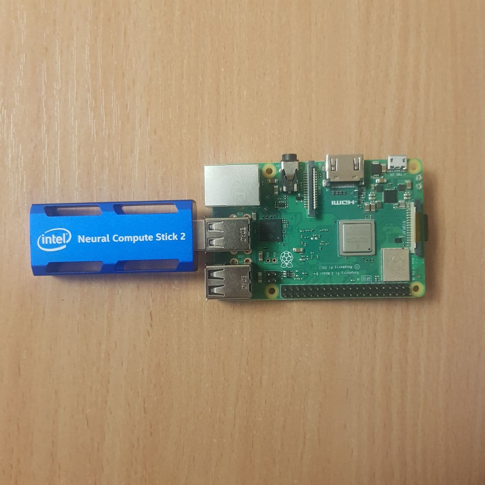
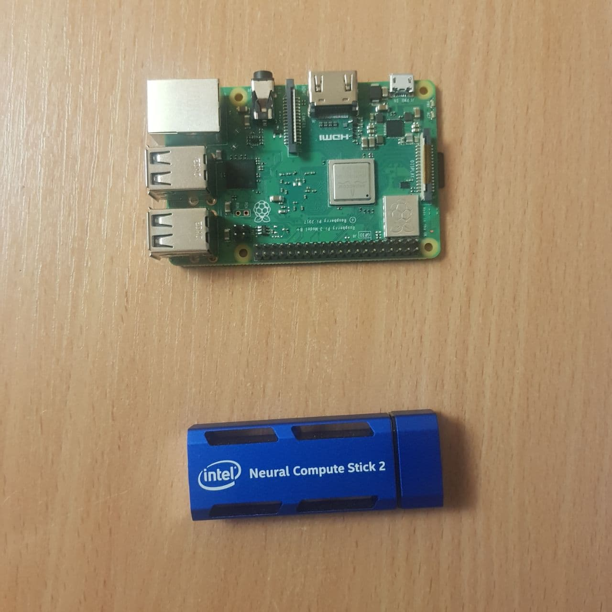

# People Counter

**Udacity Nanodegree - Project Write-up**

Shkadarevich Dmitry

---

##  Custom Layers

In some occasions, specific layers of a model might not be supported by OpenVINO. These layers are called _custom layers_.

Handling custom layers in OpenVINO first of all requires to identify such layers. This can be done either empirically, while trying to convert a model into an IR, or programmatically, by looking at the layers supported by a specific device.

Once identified, custom layers can be isolated from the optimised model and their computation can be offloaded to the CPU.

This strategy allows to perform inference with an otherwise unusable model in OpenVINO, while at the same time trying to optimise at least some of its calculations.

## Assess Effects on End User Needs

Lighting is a critical component in any vision system and can be the difference between success and failure. After all, without lighting, computer vision would be the study of black rooms with black objects. That would actually make vision programming incredibly easy, but not terribly useful. Instead the lighting should help accomplish three main goals:

-   Maximize the contrast of the features of interest
    
-   Be generalized enough that it works well from one object to the next
    
-   Be stable within the environment, particularly over time

## Model Research
My choice fell on [**ssd\_mobilenet\_v2**](https://docs.openvinotoolkit.org/latest/omz_models_model_ssd_mobilenet_v2_coco.html) 

YOLO (You Only Look Once) system, an open-source method of object detection that can recognize objects in images and videos swiftly whereas SSD (Single Shot Detector) runs a convolutional network on input image only one time and computes a feature map. SSD is a better option as we are able to run it on a video and the exactness trade-off is very modest.

SSD is a healthier recommendation. However, if exactness is not too much of disquiet but you want to go super quick, YOLO will be the best way to move forward. First of all, a visual thoughtfulness of swiftness vs precision trade-off would differentiate them well.

#### **You only Look Once (YOLO)**

For YOLO, detection is a straightforward regression dilemma which takes an input image and learns the class possibilities with bounding box coordinates. YOLO divides every image into a grid of S x S and every grid predicts N bounding boxes and confidence. The confidence reflects the precision of the bounding box and whether the bounding box in point of fact contains an object in spite of the defined class. YOLO even forecasts the classification score for every box for each class. You can merge both the classes to work out the chance of every class being in attendance in a predicted box.

So, total SxSxN boxes are forecasted. On the other hand, most of these boxes have lower confidence scores and if we set a doorstep say 30% confidence, we can get rid of most of them.

#### **Single Shot Detector (SSD)**

SSD attains a better balance between swiftness and precision. SSD runs a convolutional network on input image only one time and computes a feature map. Now, we run a small 3×3 sized convolutional kernel on this feature map to foresee the bounding boxes and categorization probability.

SSD also uses anchor boxes at a variety of aspect ratio comparable to Faster-RCNN and learns the off-set to a certain extent than learning the box. In order to hold the scale, SSD predicts bounding boxes after multiple convolutional layers. Since every convolutional layer functions at a diverse scale, it is able to detect objects of a mixture of scales.

## Deployment
Despite the fact of poor performance, [**ssd\_mobilenet\_v2**](https://docs.openvinotoolkit.org/latest/omz_models_model_ssd_mobilenet_v2_coco.html) is good enough for deploying on edge devices such as [NCS-2](https://software.intel.com/content/www/us/en/develop/hardware/neural-compute-stick.html)

I used Raspberry Pi with Intel® Neural Compute Stick 2.

